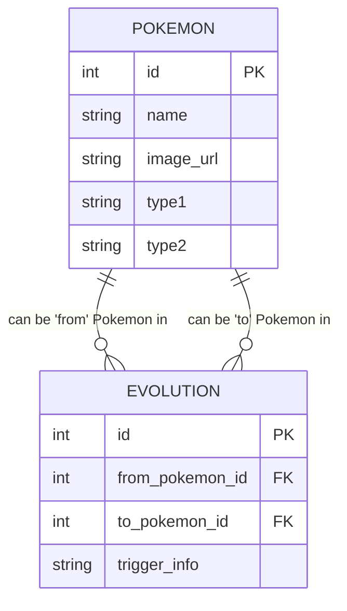

# Pokemon Relationship Explorer

A simple and beautiful interface for exploring relationships between Pokemon.

Visually explore the relationships between Generation 1 Pokemon, focusing on
evolutions and shared types.

## Project Goal & Vision

My goal is to create a web application where it's easy and fun to explore new
and familiar Pokemon. Evolutions and types are common vectors to discover
related Pokemon.

### Target User Experience

- A central, large image shows the "focused" Pokemon.
- Smaller, clickable images of related Pokemon are displayed around it:
  - Evolutions: Pokemon it evolves _from_ and _into_ are shown (e.g., vertically).
  - Shared Types: Other Pokemon sharing the same type(s) are shown (e.g., horizontally).
- Clicking (swiping?) any related Pokemon image shifts the focus to that Pokemon.

## Database Structure

The relationship between Pokemon and their specific evolution steps is modeled
using two main tables: `Pokemon` and `Evolution`. The relationship "related by
type" is handled by comparing data within the `Pokemon` table in the
application logic, not by a direct database link shown here.



## Getting Started

### Prerequisites

- Nix: The Nix package manager is required to set up the development
  environment defined in shell.nix.

### Installation & Setup (using Nix)

1. Clone the Repository:

```bash
git clone https://github.com/beauremus/pokedex-explorer
cd pokedex-explorer
```

1. Enter the Development Environment:

This command reads the shell.nix file and makes Ruby, NodeJS, SQLite, and Rails
available.

```bash
nix-shell
```

(This might takes some time on the first run to download dependencies)

1. Install Ruby Gems:

Inside the nix-shell, use Bundler to install the gems specified in the Gemfile.

```bash
bundle install
```

1. Setup the Database:

This command will create the database (if it doesn't exist), load the schema,
and run the seed file.

```bash
rails db:setup
```

## Usage

1. Start the Rails Server:

```bash
# Ensure you are inside the nix-shell
rails server
```

1. Access the Application:

Open your web browser and navigate to [http://localhost:3000](http://localhost:3000).

1. Explore:

Click on the Pokemon images to navigate through evolutions and related types.

## Development

- Running Tests:

```bash
rails test
```

- Database Migrations: If the database schema changes create a migration
  file:

```bash
rails generate migration AddColumnToTable column:type
rails db:migrate
```

- Seed Data: The Pokemon data (names, types, images, evolutions) is
  populated from db/seeds.rb. Modifying this file and re-running rails db:seed
  will update the database content.

## Contributing

This is a source-available project. Contributions will not be considered.

## License

This project is licensed under the terms of the copy-left GNU Affero General
Public License v3.0 (AGPLv3).

## Acknowledgements

Pokemon data sourced/referenced from Bulbapedia and PokeAPI.

Built with Ruby on Rails and the awesome Nix package manager.
